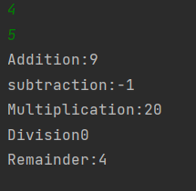
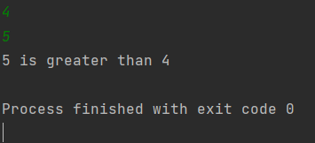
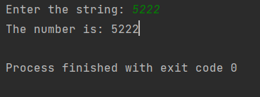
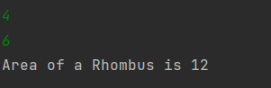
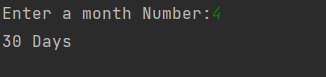
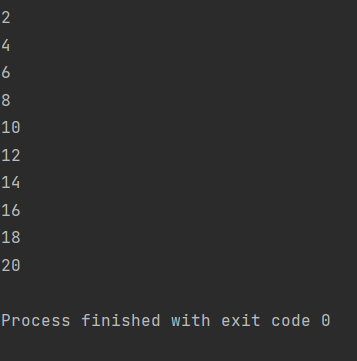
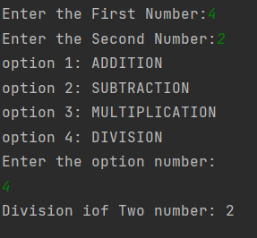
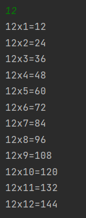

# Java_Assignment_1
## Name: Anitha.P
## Register Number: 212221240004
### 1. Write a Java program to print the sum,multiply,subtrct,divide and remainder of two numbers.
```java
public class arithmetric {
    public static void main(String[] args)
    {
        Scanner sc=new Scanner(System.in);
        int add,sub,multi,div,rem;
        int num1=sc.nextInt();
        int num2=sc.nextInt();
        add=num1+num2;
        sub=num1-num2;
        multi=num1*num2;
        div=num1/num2;
        rem=num1%num2;
        System.out.println("Addition:"+add+"\nsubtraction:"+sub+"\nMultiplication:"+multi+"\nDivision"+div+"\nRemainder:"+rem);

    }
}
```
## Output:

### 2. Write a Java program to compare two numbers.
```
public class compare_two_num {
    public static void main(String[] args){
        Scanner sc=new Scanner(System.in);
        int num1=sc.nextInt();
        int num2=sc.nextInt();
        if(num1>num2)
        {
            System.out.println(num1+" is greater than "+num2);
        }
        else if(num2>num1) {
            System.out.println(num2+" is greater than "+num1);
        }
        else {
            System.out.println("Numbers are Equal");
        }
    }
}
```
## Output:

### 3. Write a Java program to convert a string to an integer.
```
import java.util.Scanner;
public class str_to_int
{
    public static void main(String[] args)
    {
        Scanner input=new Scanner(System.in);
        System.out.print("Enter the string: ");
        String str=input.nextLine();
        int num=Integer.parseInt(str);
        System.out.println("The number is: "+num);
    }
}
```
## Output:

### 4. Java program to find area of rhombus.
```
import java.util.Scanner;
public class area_rhombus {
    public static void main(String[] args){
        Scanner sc=new Scanner(System.in);
        int p,q;
        p=sc.nextInt();
        q=sc.nextInt();
        int area=(p*q)/2;
        System.out.println("Area of a Rhombus is "+area);
    }
}

```
## Output:

### 5. Write a Java program to find the numbers of days in a month.
```
import java.util.Scanner;
public class no_of_days_in_a_month {
    public static void main(String[] args){
        Scanner sc=new Scanner(System.in);
        int mon;
        System.out.print("Enter a month Number:");
        mon=sc.nextInt();
        switch(mon)
        {
            case 1:
                System.out.println("31 Days");
                break;

            case 2:
                System.out.println("28 Days");
                break;
            case 3:
                System.out.println("31 Days");
                break;
            case 4:
                System.out.println("30 Days");
                break;
            case 5:
                System.out.println("31 Days");
                break;
            case 6:
                System.out.println("30 Days");
                break;
            case 7:
                System.out.println("31 Days");
                break;
            case 8:
                System.out.println("31 Days");
                break;
            case 9:
                System.out.println("30 Days");
                break;
            case 10:
                System.out.println("31 Days");
                break;
            case 11:
                System.out.println("30 Days");
                break;
            case 12:
                System.out.println("31 Days");
                break;
        }


    }
}

```
## Output:

### 6.  Write a Java program to print the even numbers from 1 to 20.
```
public class even_num {
    public static void main(String[] args){
        for(int i=1;i<=20;i++)
        {
            if(i%2==0)
            {
                System.out.println(i);
            }

        }
    }
}

```
## Output:

### 7. Write a Java program to create a simple calculator.
```
import java.util.Scanner;
public class calculator {
    public static void main(String[] args){
        int num1,num2;
        int add,sub,multi,div;

        Scanner sc=new Scanner((System.in));
        System.out.print("Enter the First Number:");
        num1=sc.nextInt();
        System.out.print("Enter the Second Number:");
        num2=sc.nextInt();
        int op;
        System.out.println("option 1: ADDITION\noption 2: SUBTRACTION\noption 3: MULTIPLICATION\noption 4: DIVISION\nEnter the option number:");
        op=sc.nextInt();
        switch(op)
        {
            case 1:
                add=num1+num2;
                System.out.println("Addition of two Number: "+add);
                break;
            case 2:
                sub=num1-num2;
                System.out.println("Subtraction of two number: "+sub);
                break;
            case 3:
                multi=num1*num2;
                System.out.println("Multipication of Two Number: "+multi);
                break;
            case 4:
                div=num1/num2;
                System.out.println("Division iof Two number: "+div);
                break;
            default:
                System.out.println("Enter the only  the option number");

        }


    }
}

```
## Output:

### 8. Write a Java program to print multiplication table of given number.
```
import java.util.Scanner;
public class tables {
    public static void main(String[] args){
        Scanner sc=new Scanner((System.in));
        int i;
        int num;
        int result;
        System.out.println("Enter the table number:");
        num=sc.nextInt();
        for(i=1;i<=12;i++)
        {
            result=num*i;
            System.out.println(num+"x"+i+"="+result);

        }
    }
}

```
## Output:

